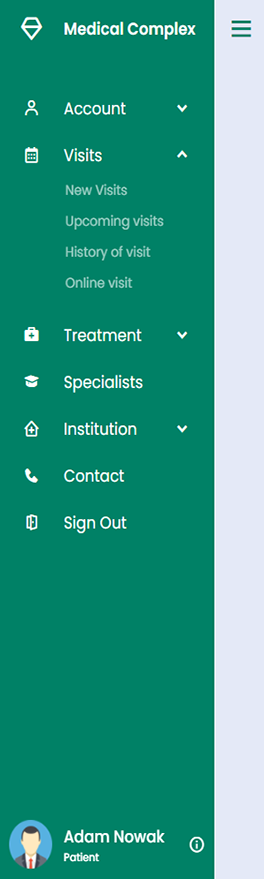

___

# General info

Medical Complex is my own REST API project that is currently in development. The service is to enable management of a
network of medical facilities providing comprehensive medical and cosmetic services.

The application will allow:

### For users

- creating a patient account
- account data management
- database of planned and completed visits
- database of medical history and treatment
- feedback system of visits and specialists

### For specialist

- creating a specialist account
- administration of the range of services provided
- regular patient base
- schedule of future visits
- possibility to provide online services

# News 

- Responsive control panel (12.09.2021)

|   Dashboard On   |    Dashboard Off   |
|------------------|--------------------|
|       |      |

  
# Technologies

___

- Java 16
- Spring Boot
- Hibernate
- JPA
- Project Lombok
- BCrypt
- MySQL
- HTML/JSP
- CSS

# Contact

### Email: robert.jachowicz.kontakt@gmail.com

#### Please add suggestions or contact me if you like my project.

#### Don't forget to visit my [LinkedIn](https://www.linkedin.com/in/robert-jachowicz-846548214/) profile as well.

#### See also my other projects on GitHub 🙂
- [Car Repair](https://github.com/Robert3107/CarRepair)
